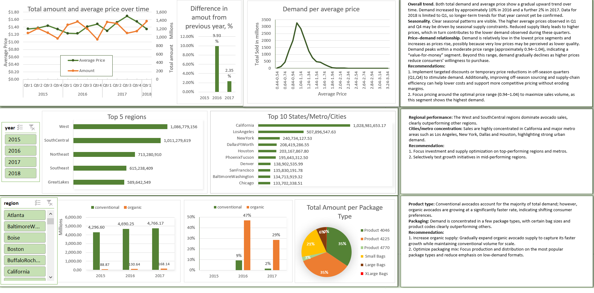

# WIDL Data Analyst Task Report

## 1. Description of the Task
As part of my educational journey in the **Generation Data Bootcamp**, I completed an individual project designed to assess my practical skills in data analysis using **Excel**. The project involved analyzing a dataset containing weekly avocado sales across American stores.

The objective was to explore the data and answer the following business questions:

- Are there any macro trends over time relating to avocados across all regions?
- Which regions had the highest demand for avocados in 2018?
- Is there a difference in demand for conventional versus organic avocados?
- How does avocado pricing impact demand?

The analysis was required to be presented entirely in **Excel**, using appropriate charts and visualizations to clearly communicate insights and trends.

---

## 2. Challenges Faced and Solutions

One of the main challenges occurred while addressing **Question 2 – Regions with Highest Demand**.  
The dataset included a mix of **individual cities** and **large geographic regions** (e.g. *West*, *SouthEast*). Comparing sales figures across these different geographic levels would result in inaccurate conclusions.

To resolve this issue, I divided the data into two distinct groups:
- **Regions**
- **Cities / Metropolitan Areas**

Separate bar charts were created for each group, ensuring fair and meaningful comparisons within the same geographic level.

Another challenge arose when analyzing **Question 4 – Price vs Demand**.  
The dataset contained a wide range of average price values, making it impractical to assess demand at each individual price point.

To address this, I grouped prices into **price buckets (ranges)** and calculated total demand for each bucket. This approach allowed for a clearer visualization of how demand changes as prices increase or decrease.

---

## 3. Answers to Questions
To answer the project questions, I developed an **interactive Excel dashboard** that enables exploration of the dataset from multiple perspectives. The dashboard allows users to:

- Observe overall sales trends and seasonality
- Identify regional and city-level demand patterns
- Compare demand for conventional and organic avocados
- Analyze the relationship between average price and demand
- Review sales distribution across different package types

This interactive format supports deeper analysis and makes key insights easier to identify.

---

## 4. Recommendations / Insights

**Overall trends:**  
Both total demand and average price show a gradual upward trend over time. Demand increased by approximately **10% in 2016** and a further **2% in 2017**. Data for 2018 is limited to Q1, so longer-term trends for that year cannot yet be confirmed.

**Seasonality:**  
Clear seasonal patterns are visible. Higher average prices in **Q1 and Q4** are likely driven by seasonal supply constraints, which contribute to lower demand during these periods.

**Price–demand relationship:**  
Demand is relatively low in the lowest price ranges and increases as prices rise, peaking in a moderate price range of approximately **0.94–1.04**, indicating a strong “value-for-money” segment. Demand declines at higher prices as consumers become more price-sensitive.

**Recommendations:**
- Implement targeted discounts or temporary price reductions in off-season quarters (Q1, Q4) to stimulate demand.
- Improve off-season sourcing and supply-chain efficiency to reduce costs and support competitive pricing.
- Focus pricing strategies around the **optimal price range (0.94–1.04)** to maximize sales volume.

---

**Regional performance:**  
The **West** and **SouthCentral** regions dominate avocado sales, significantly outperforming other regions.

**City / metro concentration:**  
Sales are heavily concentrated in **California** and major metropolitan areas such as **Los Angeles, New York, Dallas, and Houston**, highlighting strong urban demand.

**Recommendations:**
- Prioritize investment and supply optimization in top-performing regions and metro areas.
- Selectively test growth initiatives in mid-performing regions.

---

**Product type:**  
Conventional avocados account for most total demand, while **organic avocados show significantly faster growth**, indicating changing consumer preferences.

**Packaging:**  
Demand is concentrated in a limited number of package types, with certain bag sizes and product codes clearly outperforming others.

**Recommendations:**
- Gradually expand organic avocado supply while maintaining conventional volume for scale.
- Optimize the packaging mix by focusing on high-demand formats and reducing emphasis on low-performing ones.

